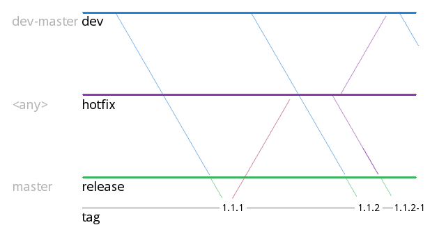
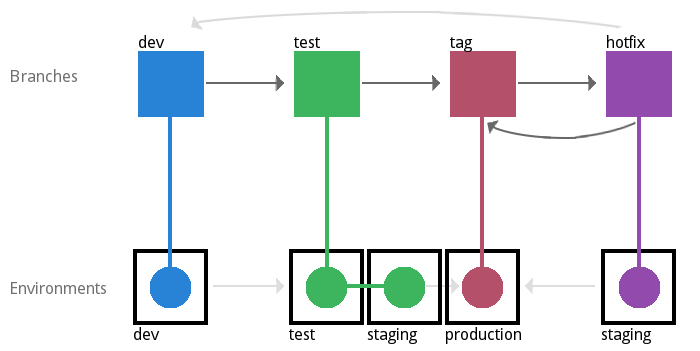

<style>
    em {
        color: red;
        font-style: normal;
    }
</style>

# Dev codex

## Revision

| Author          | Change            | Time       |
|-----------------|-------------------|------------|
| Daniel Leppänen | First draft       | 2017-10-27 |

## Code styling

### Tabs vs Spaces

* 2 spaces for <em>JavaScript</em>.
* 4 spaces for everything else unless stated otherwise.
* No trailing white spaces allowed

> Pro tip: Turn on automatic trim for white spaces.
> Called "editor.trimAutoWhitespace" in VS Code

### Line endings

* Use Line-feed for line endings,  <em>\n</em>.
* No trailing new lines at the end of document.

> Pro tip: Turn on automatic trim for new lines.
> Called "files.trimFinalNewlines" in VS Code

### Linting

* <em>PSR-2</em> for PHP
* <em>Typescript official coding style</em> for JavaScript

Use `phpcs` for code control in PHP projects.

### Quotation

Use double quotation marks as default.

### Extra PHP/Laravel rules

* Transformers classes contain the models plural form, i.e. `UsersTransformer`
* Seeder classes should contain the models plural form, i.e. `AssetTypesSeeder`
* Controller classes should contain the models plural form, i.e. `AdsController`
* Factory definition files should contain the models singular form, i.e. `CustomerFactory`
* Constants should be uppercase and snake case format, i.e. `const ORDER_TYPE = 1`
* Functions (such as helper functions) should be snake_case to follow PHP standard naming convention, i.e. `json_file_to_array`
* Database pivot table names should contain both join tables in singular form, and be alphabetically ordered, i.e. `customer_order`

<div style="page-break-after: always;"></div>
<div style="margin-bottom: 80px"></div>

## Versioning and deploy

The major-minor system (standard by GNU) should be used.
`Major.minor.revision[-hotfix]`

### Prioritizing

Prioritize based on MoSCoW

* Must
* Should
* Could
* Would

### Branching

_Git-flow_ strategy (https://datasift.github.io/gitflow/IntroducingGitFlow.html) should be used, see picture.


> Old names in grey

### Deploy flow

Automatic deploy for dev environment.
Test can be used as demo and should not have automatic deploys.


#### Deploy pipelines

Write about docker deployment here

* WIP

<div style="page-break-after: always;"></div>
<div style="margin-bottom: 80px"></div>

## Project management

Technical details about project should be managed in GitLab.
(From **SCRUM**:
_Issues_ are similar to _User stories_
_Milestones_ are similar to _Epics_)

## Technical documentation

Technical documentations, HOWTOWs, script files, etc should be stored along with the git project and managed in versions

Put all files in `other/` (path relative to project root)
Example of file tree:

```sh
    other/
        |---- installation.md
        |---- how-to-deploy.md
        |---- scripts/
                |---- backup-prod.go
```
